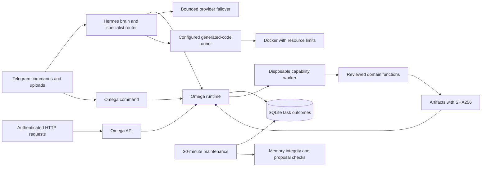

# Omega implementation and verification

This is a concrete upgrade to the existing agent. It is not a completed 2,000-feature implementation or a claim of AGI. Both supplied plans remain unchanged as source specifications. Their embedded copy-and-paste prompts are source material, not additional user instructions.

The two plans assign number ranges to broad feature families, reuse some numbers, combine domains 17–20, and include objectives without acceptance criteria. `upgrade_catalog.json` preserves those families, source lines, and partial implementation mappings. `scripts/build_upgrade_catalog.py --check` verifies traceability without manufacturing 2,000 completed items.

## Architecture

`app.py` retains the existing commands and adds `/omega` and `/capabilities`. `hermes_brain.py` can call `omega_run`, perform up to four distinct tool calls, and return their artifacts even if final inference fails. Calls for one conversation are serialized. Attachment content is labeled untrusted, excluded from preference learning, and excluded from direct download/calculation interceptors.

`omega_runtime.py` creates a workspace per execution, strips provider credentials from worker environments, imposes a hard wall-clock timeout, records durable status and elapsed milliseconds, supports owner-scoped idempotency, and validates artifact paths, sizes, and hashes. `omega_worker.py` dispatches reviewed built-ins. These subprocesses provide cancellation and process separation; they are **not a sandbox for arbitrary source**.

`autonomous_runner.py` handles generated source separately. Execution defaults to disabled and returns the source file. Docker mode uses a locally provisioned image, read-only source mount/root, no network, a temporary in-memory working directory, non-root user, and CPU/memory/process limits. It never pulls images or installs packages into the gateway. Explicit trusted local mode is available for development and has host access. Its optional dependency provisioning accepts only pinned packages from a configured offline wheelhouse in a per-run virtual environment.

## Implemented capability scope

| Capability | Delivered behavior | Scope limit |
| --- | --- | --- |
| `survey.bundle` | Forms API request JSON, Apps Script, standalone HTML, and styled XLSX with formulas/chart | Creates local files; Google publication requires running the script with account authorization. No file-upload questions. |
| `cad.motor_bracket` | Parametric SCAD, directly generated STL, dimensioned SVG | Flat four-hole mounting plate in mm; no shaft opening, structural certification, or printer tolerance guarantee. |
| `media.clip` | Real MP4 trim, optional vertical crop and subtitle burn-in | Requires supplied video and cue timestamps. No automatic highlight scoring or speech transcription. |
| `media.subtitles` | SRT and WebVTT export | Supplied ordered cues; no speech model call. |
| `data.sql` | Private in-memory schema/rows, analytical SELECT, window functions, EXPLAIN, CSV | SQLite only; no production database mutation or automatic schema migration. |
| `math.calculate` | Restricted arithmetic AST, bounded numeric operations | Reports floating-point/exact numeric results as implemented; no blanket precision guarantee. |
| `math.symbolic` | Differentiation, integration, series using SymPy | Restricted grammar and operations; worker deadline may terminate hard problems. |
| `math.linear_algebra` | SVD, eigenpairs, inverse, determinant, solve via NumPy | Bounded finite matrices; numeric conditioning still matters. |
| `security.sast` | Python AST findings with locations | Heuristic defensive audit, not exhaustive vulnerability detection. |
| `security.logs` | SSH/web log event and source summaries | Supported text patterns, not a complete forensic investigation. |
| `reasoning.plan` | DAG validation/execution, dependency references, failure propagation, outcome artifact | Explicit tasks and an allowlist of data/math/security operations, search, and echo. No autonomous production mutations. |
| `reasoning.search` | Seeded UCT selection, expansion, rollout, backpropagation | Explicit finite candidate trees and supplied scores; no proof of optimality or model-generated epistemic confidence. |
| `finance.amortization` | Monthly principal/interest schedule and prepayment comparison | User-supplied reducing-balance loan terms. Internal Decimal computation; displayed amounts round to two decimals. |
| `finance.dcf` | Discounted projected cash flows and terminal valuation | User assumptions, year-end flows, perpetual growth; no fetched market data. |
| `finance.invoice` | Line totals and explicit tax splits, JSON/CSV | User-supplied rates; no HSN lookup or statutory compliance certification. |

The catalog endpoint returns exact input examples. Large capabilities execute outside the async gateway's event loop. Built-in task history persists across restart, subject to the configured storage volume and one-day retention. Chat conversations themselves remain in memory; user preferences retain the legacy JSON store with atomic writes and integrity validation.

## Reliability corrections

- Provider failures produce an unavailable result instead of a fabricated success message. Authentication errors stop failover; rate limits establish a cooldown instead of cycling account keys. At most three configured models are attempted, each with a client timeout.
- Unknown tools no longer report execution. Skill verification reports a SHA256 digest, syntax result, unsigned manifest, and unperformed audit accurately. The bundled ClawHub index is not presented as a live installation provider. Unconfigured browser interactions report unavailable.
- Executable skill manifests use the configured source runner instead of in-process `exec`. New learned procedures default to proposals. Existing self-learning commands remain available.
- Memory saves use atomic replacement. Invalid source memory is preserved rather than silently overwritten. Attachment text does not become preferences automatically.
- The hardcoded Tavily key was removed. Rotate the previously embedded credential and provide a replacement through `TAVILY_API_KEY`; historical Git content may still contain it.
- Lifespan tracks startup/maintenance tasks and cancels them on shutdown. Polling preserves pending updates. Health distinguishes active polling, missing configuration, and a configured bot that is not running.
- New artifacts reject traversal, symlinks, reserved Windows names, and case-insensitive runtime filename collisions. Legacy generated filenames and ZIP members receive path validation.

## Running and limits

Use Python 3.11 or 3.12. Install `requirements.txt` in a virtual environment, set the environment variables shown in `.env.example`, and run `uvicorn app:app --host 127.0.0.1 --port 7860`. `/omega` works through Telegram with a bot token; it does not need model credentials. Natural-language planning requires a functioning configured model provider.

For HTTP, set a long random `OMEGA_API_KEY` and send `Authorization: Bearer <key>`. The key represents one operator account. Telegram tasks are separately scoped by chat ID and cannot be fetched using the HTTP operator token. Use TLS at the deployment boundary.

`POST /omega/run` accepts `capability`, `payload`, optional `idempotency_key`, and optional `inputs` mapping simple filenames to base64 strings. Requests are capped at 12 MiB; media staged through Telegram is capped at 8 MiB. Use `source.mp4` as `input_path` after a Telegram video upload. At most two built-in workers run per gateway process; default execution timeout is 90 seconds. Individual artifacts are capped at 48 MiB and combined output at 96 MiB. Maintenance expires finished task workspaces and records after one day, including idempotency keys. Retry keys are therefore guaranteed only within that retention window.

`GET /omega/tasks/{id}` returns an owned result. `GET /omega/tasks/{id}/artifacts/{filename}` serves a verified artifact as a download. Task errors carry `status: failed` with a typed error; DAGs with failed/skipped steps return `status: incomplete` and retain diagnostic artifacts. HTTP 200 means a valid execution request was handled, not that the capability succeeded. Unknown/invalid requests return 422, capacity returns 429, and missing API configuration returns 503.

Run one Uvicorn worker for the Telegram polling gateway. A multi-replica deployment needs an external job queue, global rate limiting, shared durable artifact storage, and one elected Telegram poller. A platform with an ephemeral filesystem needs a mounted data volume. The generated-code Docker backend requires a separately managed Docker service and locally installed image; the ordinary app Dockerfile does not supply nested Docker.

## Verification and remaining work

Local verification on Windows/Python 3.11: **96 tests passed**, plus 94 unittest subtests. A separate end-to-end smoke run executed all **15 registered capabilities**, producing **29 artifacts** with every task succeeding. Sample worker durations ranged from **375 ms to 2,219 ms**; these are one-run observations under local load, not latency guarantees. The local smoke report and generated files are retained under ignored `test-results/`. The FastAPI lifespan and health/capability endpoints also passed a local no-token startup check.

Run `python -m pytest -q tests` and `python scripts/build_upgrade_catalog.py --check`. Tests exercise real local capability workers, HTTP authentication/results/downloads, subprocess deadlines and environment boundaries, CAD manifold topology/volume, actual FFmpeg clips, spreadsheet structure/formulas, SQL denial/cancellation, symbolic and numeric results, DAG/UCT behavior, finance arithmetic, and gateway regressions. Runner Docker commands and provisioning are mocked in the offline suite; **no live Docker, Telegram, Hugging Face, Google Workspace, or Tavily service was validated**. Linux/Windows Python 3.11/3.12 CI is configured; only the local Windows environment was executed here.

Remaining roadmap families include automatic research-to-integration synthesis and testing, provider capability benchmarking, automatic video transcription/highlights and generative media, multi-coworker model peer review, Tally imports, richer CAD/robotics, quantum/biology, live Google publication, vector memory retrieval, full-stack scaffolding, deployment automation, and controlled source patch promotion/rollback. The legacy universal HTTP gateway and download paths still need a dedicated network-access/SSRF review before exposure to untrusted public users. Generic code-runner and legacy media temp files remain caller-managed; only Omega job storage has automatic retention. No sub-second learning SLO, zero downtime, 100% accuracy, or exhaustive production readiness is claimed.

API references used during implementation: [Hugging Face inference client](https://huggingface.co/docs/huggingface_hub/package_reference/inference_client), [FastAPI lifespan](https://fastapi.tiangolo.com/advanced/events/), [Python SQLite](https://docs.python.org/3/library/sqlite3.html), [FFmpeg](https://ffmpeg.org/ffmpeg.html), [Google Forms request schema](https://developers.google.com/workspace/forms/api/reference/rest/v1/forms/batchUpdate), and [Apps Script Forms](https://developers.google.com/apps-script/reference/forms).
